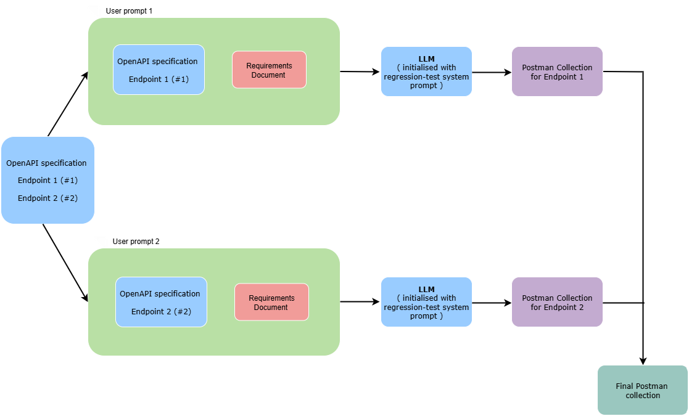

# Regression testing agent 
This project takes an OpenAPI specification, a requirements document that defines changes to the API, and generates a Postman Collection testing every endpoint within the API specification, to test the new API specification with all the modifications provided in the requirements document. 

## Table of Contents
- [Overview](#overview)
- [Features](#features)
- [Installation](#installation)
- [Usage](#usage)
- [Project-Structure](#project-structure)

## Overview
To handle issues of context and prompt length when generating postman collection test cases, we implemented the following architecture. 

The process first splits the OpenAPI specification into separate specifications for each endpoint, where each specification is complete and contains all the relevant references. Each one of these is then passed, along with the requirements document, to the LLM. We prompt the LLM to understand the structure of the API endpoint based on the specification, if the changes specified in the requirement document are relevant to the endpoint, update its understanding about the API endpoint, and finally generate regression tests. This outputs a separate Postman collection for each endpoint that can then be merged together to produce the final collection. 

This represents a distributed way of generating regression test cases for large API specifications, and could potentially be run in parallel, thus providing a scalable solution. 

## Features
Within the project we prompt the LLM such that it takes the OpenAPI spec of one endpoint and updates its internal representation of the endpoint based on whether the changes in the requirement document are associated with the endpoint. The LLM is then prompted to generate regression tests, aiming to maximise test coverage on the endpoint. 

I found that trying to deal with both functional and regression test cases at once was too complex and there weren't enough tokens available to generate extensive postman collections for both scenarios. Hence I decided to tackle the simpler, or rather more instructable case first - regression testing. 

I wanted to test how powerful and discriminative the LLM could be when generating test cases, and whether it would correctly pick up on changes to an endpoint and test them. For these reasons, I did not feed in an existing postman collection. In a real world use case, the task might be simpler to instead update an existing postman collection based on the current specification and changes in the requirement document.  

## Installation
Run the following commands in the terminal:
python -m venv venv 
source venv/bin/activate 
pip install -r requirements.txt 

## Usage
To run the project, store an OpenAPI specification you want to use in the input_data folder, and update the path to the file (stored in SPECIFICATION_FILE in main.py).

Additionally change the Requirements Document to reflect the changes in your API (i.e. change REQUIREMENTS_SPEC_DOC in req_doc.py). 

Run main.py to generate the new postman collection, the final collection will be stored in merged_regression_collection.py in the outputs/ folder, which can then be imported into Postman. 

NOTE: the prompt assumes that you are using an api that requires an API key, and both the url and the api key are stored as base_url and app_key in Postman. 

